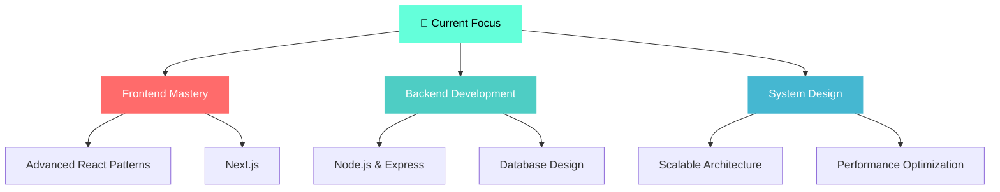

<div align="center">
  
</div>

<div align="center">
  
</div>

<div align="center">
  
</div>

---

##  About Me


**🎓 Third-Year Engineering Student**  
**💻 Full-Stack Developer**  
**🌟 Open Source Enthusiast**

```javascript
const developer = {
    name: "d-j7code(That's me😅)",
    location: "India 🇮🇳",
    currentFocus: "Building impactful web applications",
    passion: ["Problem Solving", "Clean Code", "User Experience"],
    motto: "Debugging life, one commit at a time!"
};
```

<br clear="right"/>

---

##  Tech Stack

<div align="center">

**Frontend**  


**Backend & Languages**  


**Design & Tools**  


</div>

---

##  What I Love Creating
<table align="center">
<tr>
<td align="center" width="33%">

<h4>⚡ Lightning-Fast Web Apps</h4>
<p>Building responsive, blazing-fast experiences that users love</p>
</td>
<td align="center" width="33%">

<h4>📱 Beautiful User Interfaces</h4>
<p>Crafting pixel-perfect designs that blend form with function</p>
</td>
<td align="center" width="33%">

<h4>🛠️ Developer Tools</h4>
<p>Creating utilities that make developers' lives easier</p>
</td>
</tr>
</table>

---

##  GitHub Stats

<div align="center">
  


</div>

---
##  Contribution Snake
<div align="center">
  
</div>

---

##  My Current Learning Journey

<div align="center">




</div>

---

##  Let's Connect

<div align="center">

<a href="mailto:davidcourses10@gmail.com">
  
</a>
<a href="https://your-portfolio.com">
  
</a>

</div>

---

<div align="center">

### 💭 Daily Inspiration

*"Open source isn't just code—it's community, collaboration, and creativity."*

<br>


**Thanks for visiting! ⭐ Star repositories you find interesting!**

</div>

<div align="center">
  
</div>
